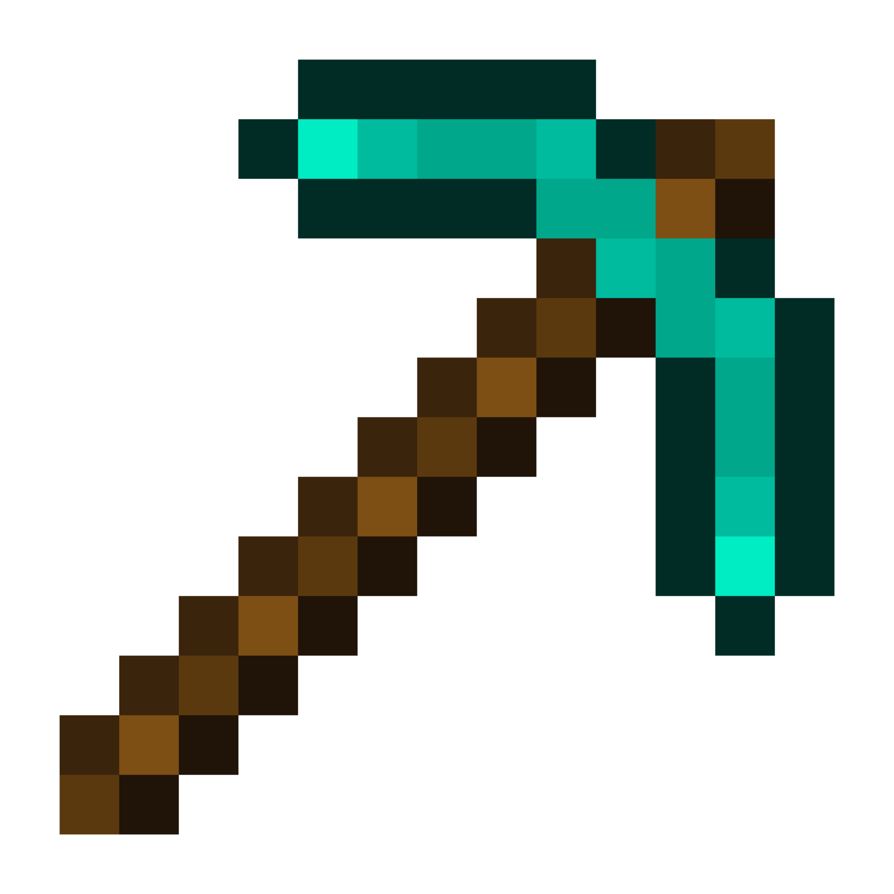

---
# An instance of the Featurette widget.
# Documentation: https://wowchemy.com/docs/page-builder/
widget: blank

# This file represents a page section.
headless: true

# Order that this section appears on the page.
weight: 30

title: Skills
subtitle:
---

  

  
Pickaxe

    
  

  

