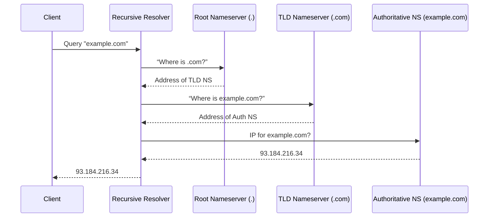

## Public Cloud Module 9 – Route 53: DNS Basics, Routing Policies & Experiments

I’ve just wrapped up the first part of our “Public Cloud Module 9” focused entirely on **Amazon Route 53**. Before we move on to CloudFront and the API Gateway, I want to capture the learnings here in my blog. DNS is effectively the phonebook of the internet, translating human-friendly domain names (like `amanox.ch`) into IPs. In the slides, we revisited the standard DNS resolution path with root, TLD, and authoritative name servers. Below is a quick diagram demonstrating the DNS lookup flow (who queries who):



**Why do I even care?**  
Well, in the AWS ecosystem, Route 53 not only handles standard DNS “A” or “CNAME” records; it also offers domain registration, health checks, and a bunch of advanced routing policies. And yes, you can do it all in a single place, which is neat compared to juggling multiple external registrars, DNS providers, etc.

### My Hands-on Experience with Subdomain `test.jexinator.ch`

Since my apex domain is already in use, I decided to create a subdomain entry in Route 53 for `test.jexinator.ch`. I’ve configured and tested different **Routing Policies**. Each policy required me to create or adjust A records, often combined with health checks. Then I used `nslookup`, `dig`, `curl`, or occasionally jumped onto a VPN to see how DNS responded from different locations.

Simple routing was straightforward. I registered two public IPs (one in Frankfurt, one in Tokyo) under a single A record set. Route 53 randomly switched between them, as verified by repeated queries. The weighted routing was even better. I assigned 70% of the traffic to the Frankfurt instance and 30% to Tokyo. In the command line, I counted the queries to confirm the approximate ratio.

Failover routing felt more “production-ish.” I designated Frankfurt as primary and Tokyo as secondary, attaching a health check to each. Simulating a downtime in Frankfurt triggered an automatic failover to Tokyo. Sure, it’s a bit contrived for a “Hello World” site, but you get the idea.

Finally, I tested geolocation. I set Frankfurt as default and Tokyo specifically for Asian visitors. Thanks to a VPN set to Asia, I validated that it resolved the Tokyo IP (and seeing “Hello World from Tokyo!” in my browser).

### Code Snippet for the Infrastructure

For completeness, I spun up the two EC2 instances with Terraform, in separate regions: `eu-central-1` for Frankfurt and `ap-northeast-1` for Tokyo. They each run Apache to serve a static “Hello World” webpage. Here’s just the essential snippet for the Frankfurt instance:

```hcl
resource "aws_instance" "vm-eu-central-one" {
  ami               = "ami-0d1b147464190188b"
  instance_type     = "t2.micro"
  subnet_id         = aws_subnet.public_subnet.id
  key_name          = "mig"
  user_data         = <<-EOF
                      #!/bin/bash
                      sudo apt update -y
                      sudo apt install apache2 -y
                      sudo systemctl start apache2
                      cd /var/www/html
                      echo "<h1>Hello World from Frankfurt!</h1>" > index.html
                      EOF
  ...
}
```

Tokyo is nearly the same, with a different AMI and region. After applying the Terraform config, I tested connectivity and then integrated it all with Route 53.

### My Key Takeaways

I already knew DNS was important, but it's great to see how comprehensive AWS makes it with Route 53. The advanced routing policies are quite powerful: failover, weighted, geolocation, and geoproximity all enable me to direct traffic more precisely. Health checks tie in neatly, so Route 53 can react if a certain endpoint goes down. For small-scale personal websites, some of this might be overkill, but for production setups that require high availability or region-based compliance, it’s clutch.

It's great to see how comprehensive AWS makes DNS management with Route 53, especially for custom domain setups or global content distribution. Stay tuned.

---
