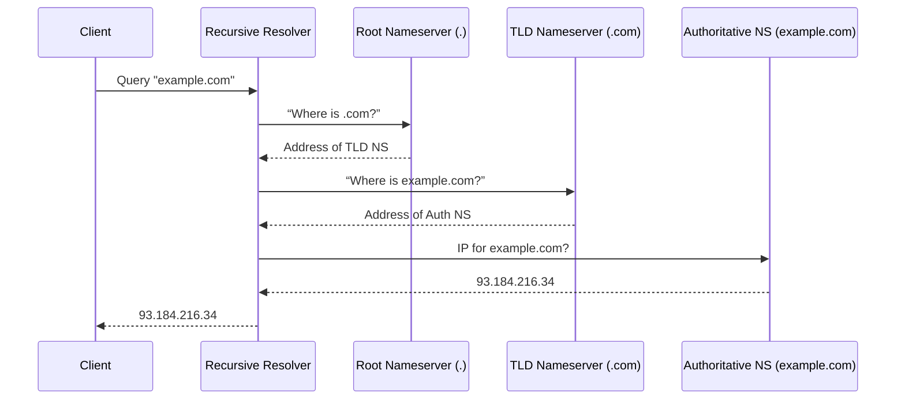

# Public Cloud Module 9 – Route 53: DNS Basics, Routing Policies & Experiments

## Amazon Route 53

I’ve just wrapped up the first part of our “Public Cloud Module 9” focused entirely on **Amazon Route 53**. Before we move on to CloudFront and the API Gateway, I want to capture the learnings here in my blog. DNS is effectively the phonebook of the internet, translating human-friendly domain names (like `amanox.ch`) into IPs. In the slides, we revisited the standard DNS resolution path with root, TLD, and authoritative name servers. Below is a quick diagram demonstrating the DNS lookup flow (who queries who):



**Why do I even care?**  
Well, in the AWS ecosystem, Route 53 not only handles standard DNS “A” or “CNAME” records; it also offers domain registration, health checks, and a bunch of advanced routing policies. And yes, you can do it all in a single place, which is neat compared to juggling multiple external registrars, DNS providers, etc.

### My Hands-on Experience with Subdomain `test.jexinator.ch`

Since my apex domain is already in use, I decided to create a subdomain entry in Route 53 for `test.jexinator.ch`. I’ve configured and tested different **Routing Policies**. Each policy required me to create or adjust A records, often combined with health checks. Then I used `nslookup`, `dig`, `curl`, or occasionally jumped onto a VPN to see how DNS responded from different locations.

Simple routing was straightforward. I registered two public IPs (one in Frankfurt, one in Tokyo) under a single A record set. Route 53 randomly switched between them, as verified by repeated queries. The weighted routing was even better. I assigned 70% of the traffic to the Frankfurt instance and 30% to Tokyo. In the command line, I counted the queries to confirm the approximate ratio.

Failover routing felt more “production-ish.” I designated Frankfurt as primary and Tokyo as secondary, attaching a health check to each. Simulating a downtime in Frankfurt triggered an automatic failover to Tokyo. Sure, it’s a bit contrived for a “Hello World” site, but you get the idea.

Finally, I tested geolocation. I set Frankfurt as default and Tokyo specifically for Asian visitors. Thanks to a VPN set to Asia, I validated that it resolved the Tokyo IP (and seeing “Hello World from Tokyo!” in my browser).

### Code Snippet for the Infrastructure

For completeness, I spun up the two EC2 instances with Terraform, in separate regions: `eu-central-1` for Frankfurt and `ap-northeast-1` for Tokyo. They each run Apache to serve a static “Hello World” webpage. Here’s just the essential snippet for the Frankfurt instance:

```hcl
resource "aws_instance" "vm-eu-central-one" {
  ami               = "ami-0d1b147464190188b"
  instance_type     = "t2.micro"
  subnet_id         = aws_subnet.public_subnet.id
  key_name          = "mig"
  user_data         = <<-EOF
                      #!/bin/bash
                      sudo apt update -y
                      sudo apt install apache2 -y
                      sudo systemctl start apache2
                      cd /var/www/html
                      echo "<h1>Hello World from Frankfurt!</h1>" > index.html
                      EOF
  ...
}
```

Tokyo is nearly the same, with a different AMI and region. After applying the Terraform config, I tested connectivity and then integrated it all with Route 53.

### My Key Takeaways

I already knew DNS was important, but it's great to see how comprehensive AWS makes it with Route 53. The advanced routing policies are quite powerful: failover, weighted, geolocation, and geoproximity all enable me to direct traffic more precisely. Health checks tie in neatly, so Route 53 can react if a certain endpoint goes down. For small-scale personal websites, some of this might be overkill, but for production setups that require high availability or region-based compliance, it’s clutch.

It's great to see how comprehensive AWS makes DNS management with Route 53, especially for custom domain setups or global content distribution.

## Amazon API Gateway

Having completed the basics of Route 53, I moved on to **Amazon API Gateway** for the second part of our module. In theory, API Gateway acts as a “front door” for applications, letting you create and deploy RESTful or WebSocket APIs that serve traffic to backend services such as Lambda, EC2, or DynamoDB. You can protect your endpoints with mechanisms like Amazon Cognito or a custom authorizer Lambda to control who gets access. On top of that, you can enable canary releases—very practical if you want to test a new version of your API on a small percentage of your users before rolling it out to everyone.

### My Setup with Lambda, Terraform, and Cognito

I decided to begin by creating a simple **Lambda function** that returns a plain “Hello World!” string. To accomplish that, I wrote a short Python script, zipped it up, and let Terraform handle the rest. In my Terraform config, I included a **data** block to zip the Python file, then declared the IAM role and policies needed for Lambda to run. Afterwards, I defined the actual Lambda function with a `python3.13` runtime, pointing to my newly created ZIP file. I then assigned a function URL so I could quickly test everything in my browser without any additional configuration.

Once the basic function was running, I set up **API Gateway** in a separate Terraform file. I started by creating a REST API with a descriptive name and then added a new resource called “hello.” For incoming requests on the “GET” method, API Gateway points to my Lambda function, thanks to an AWS proxy integration. I also granted explicit permission for API Gateway to invoke the Lambda via a dedicated resource that references the REST API’s ARN. Next, I created a deployment linked to a stage named “test.” Terraform picks up the final invoke URL from the stage, which is a handy way to reference it in other configurations or outputs.

With the public endpoint available, I switched over to **Amazon Cognito** for securing the API. In my Terraform file dedicated to Cognito, I generated a user pool with a simple schema to auto-verify email addresses. I also created a user pool client, adding redirects back to my “test” stage’s URL when authentication succeeds. Finally, I defined a custom domain for the user pool. Cognito then gave me a hosted UI that end users can log into. To connect Cognito with API Gateway, I introduced a Cognito authorizer resource. Instead of “NONE” or “AWS_IAM,” the API’s “GET” method on the “hello” resource now uses `COGNITO_USER_POOLS` for authentication, pointing to my user pool’s ARN. When clients call the endpoint, they include the required tokens from Cognito, letting them pass the authorizer check in API Gateway.

### Canary Release for a Second Lambda

To explore **canary deployments**, I created a second Lambda function that returns a distinct message—something like “Hello from Canary!”—and then returned to the **test** stage in API Gateway. There’s a dedicated “Canary” section in the stage’s settings that lets you enable this feature. I toggled it on and routed 30% of the incoming requests to my second Lambda. By firing off repeated “/hello” calls, I could see that some of them returned my canary response while others served the original. Once I was comfortable that the second Lambda worked as intended, I promoted the canary release. That pushed the new function to 100% of the traffic, effectively making the canary version the main one.

### My Perspective

Setting up an API in AWS can feel complex because there are multiple moving parts—Lambda code, IAM roles, API Gateway settings, Cognito, and more. But it’s worth it in the end, because you get a tightly integrated system with a lot of control. You can shape your authentication, integrate with any AWS service you like, and employ advanced deployment strategies such as canary releases. In a real-world application, you might fetch data from DynamoDB, store user files in S3, or carry out other backend tasks. Connecting the dots with Terraform is straightforward once you have the building blocks in place, and the final piece—tying everything together with API Gateway—lets you expose a consistent interface to your users or other client applications.

I found the canary release feature especially interesting. It’s a powerful way to test production changes on a small subset of real users. If something goes wrong, you can back out quickly and keep your main API stable. If it’s working fine, the final “promote” step takes it to the whole audience. I can see this being a best practice when rolling out anything that carries a risk of breaking client integrations, especially if your API is widely used.

Having wrapped up my work with API Gateway, I turned my attention to **Amazon CloudFront** to speed up content delivery. CloudFront essentially acts as a global cache, serving files from edge locations around the world so that users download content from a server physically closer to them. This can reduce latency significantly, especially for static assets like HTML, CSS, or images. In addition to S3, CloudFront can integrate with various origins, including API Gateway, so the distribution can cache and deliver dynamic API responses too.

## Amazon CloudFront

### My S3-Hosted Static Website and CloudFront Distribution

I started by creating an S3 bucket to hold a single `index.html` file. The bucket is configured for website hosting and set to serve that file as the default root document. In Terraform, I wrote a resource that creates the bucket, then another resource that uploads the HTML file. Because CloudFront needs secure access to objects in S3, I generated an Origin Access Identity (OAI) specific to CloudFront, then added an S3 bucket policy that grants read permission to this OAI alone. This approach removes the need for my bucket to be publicly accessible and ensures only CloudFront can fetch the files.

Once the S3 setup was complete, I defined the CloudFront Distribution itself. In the Terraform config, I specified the S3 bucket as the origin domain name, referencing the bucket’s regional endpoint. I then attached the OAI to this origin, thereby allowing CloudFront to retrieve objects. The distribution’s default cache behavior is restricted to “GET” and “HEAD,” and set to redirect all traffic to HTTPS. I also left geo restrictions disabled, meaning the content is served worldwide. Finally, I used the default CloudFront certificate for SSL, rather than uploading a custom one. After Terraform did its work, I could see my distribution’s domain in the outputs, and hitting that domain displayed my “Hello World!” webpage, now accelerated via CloudFront’s global edge network.

### Connecting CloudFront with API Gateway

For my second task, I reused my existing API Gateway Terraform config, which exposes the “hello” resource under a `/test` stage. In a new Terraform file dedicated to CloudFront, I referenced the domain name from the API Gateway stage by stripping out the “https://” prefix and the `/test` path, leaving just the raw domain name that API Gateway provides. I then created another CloudFront distribution, this time pointing to the API Gateway domain as its origin. Since the stage in API Gateway was named “test,” I configured an `origin_path` of “/test” in my distribution so that CloudFront would route requests directly to the correct stage. To ensure authentication headers propagate, I included `Authorization` in the list of forwarded headers, which allows the distribution to pass along the token needed by the Cognito authorizer in API Gateway. I also set a TTL of zero for caching, so new requests always go back to API Gateway rather than returning a stale response. Once this was deployed, I could grab the distribution domain from Terraform’s output, append “/hello,” and then watch CloudFront serve my API. By adjusting DNS in Route 53, I could layer a custom domain on top if I wished, though I was happy enough with the default CloudFront domain for testing.

### My Reflections on CloudFront

Even for a simple static website, putting CloudFront in front of S3 is a huge win. It ensures faster load times, especially for users located far from the AWS region hosting your bucket. Likewise, fronting an API with CloudFront can ease the load on backend services by caching responses, although your caching strategy depends heavily on whether your data is dynamic or static. With more advanced configurations, you can set up behaviors for different URL paths, enforce custom SSL certificates, or add CloudFront Functions and Lambda@Edge routines to manipulate requests or responses in flight. All these options fall under the same main principle: get content closer to end users and reduce round-trip latency whenever possible.

## With this final segment of the module complete, I’ve got a robust toolchain for distributing content globally, securing it, and even caching dynamic API requests. It’s been eye-opening to see how each AWS service—Route 53, API Gateway, and now CloudFront—fits together, especially in a Terraform-driven workflow. I’ll keep exploring these services for larger-scale scenarios, but for now, this marks the end of the CloudFront exploration.
